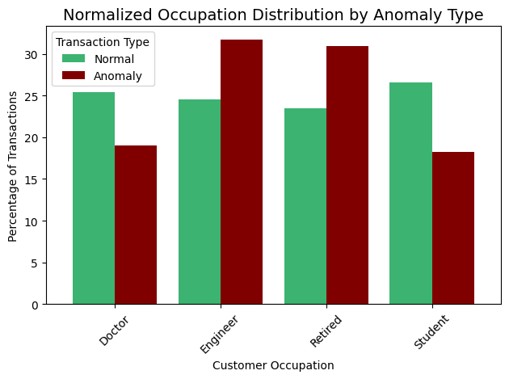

# Fraud Detection Analysis Project

## 📌 Overview

This project explores techniques for **detecting fraudulent transactions** using unsupervised learning and anomaly detection methods. The goal is not to build a production-ready fraud detection system, but to **practice data analysis, preprocessing, clustering, and anomaly detection techniques** on financial transaction data.

**Goal:** To explore a bank transaction dataset using clustering and anomaly detection to identify potential fraudulent patterns, and understand what characterizes risky behavior.

**Data Source:** The dataset used in this project comes from [Kaggle: Fraud Detection Dataset](https://www.kaggle.com/datasets/valakhorasani/bank-transaction-dataset-for-fraud-detection).

The data file is stored in the `data` folder as `bank.transaction.data.csv`.

---

## 🎯 Objectives

* Load and explore transaction dataset using **EDA tools and methods**
* Clean and preprocess data (scaling, removing unnecessary columns)
* Apply **dimensionality reduction (PCA)** for visualization and noise reduction
* Perform **clustering (KMeans)** and evaluate with silhouette score
* Detect potential anomalies using **Isolation Forest**
* Visualize insights with Matplotlib, Seaborn, and Plotly
* Summarize findings on transaction patterns and anomalies

---

## 🔧 Methods & Tools

* **Python Libraries**: `pandas`, `numpy`, `matplotlib`, `seaborn`, `plotly`, `scikit-learn`, `scipy`
* **Data Preprocessing**: Standardization, feature scaling
* **Dimensionality Reduction**: PCA
* **Clustering**: KMeans (optimized with silhouette score)
* **Anomaly Detection**: Isolation Forest
* **Visualization**: Correlation heatmaps, PCA scatter plots, bar plots, box plots, Choropleth Map, cluster visualizations, anomaly highlights, line graph

---

## 📊 Key Points

* Data preprocessing included **encoding** categorical variables, **standardizing** numerical features, and **filtering** unnecessary columns to prepare for clustering and anomaly detection.
* **Optimal K (clusters)** was selected using silhouette scores and the elbow method.
* PCA reduced dimensionality while preserving variance, making clusters easier to visualize.
* **Isolation Forest** flagged a subset of transactions as potential anomalies, useful for fraud risk analysis.
* Visualizations revealed differences in transaction behavior between normal and anomalous data points.

---

## 💡 Insights
> *This is the first phase of the analysis project; further engagement with stakeholders and a comprehensive understanding of the domain will significantly enhance the project's effectiveness. However, because this is synthetic data that is generated without any stakeholders involved, such interactions are not feasible.*

* ### Clusters: 
**Cluster 0 –** Middle-aged Engineers
This group is strongly associated with engineers and has an average age of around 43. They maintain moderate account balances (slightly above the overall average) and conduct moderate-sized transactions. Their transaction durations are slightly shorter than those of other groups, suggesting more efficient or straightforward transaction patterns.

**Cluster 1 –** Young Students
Dominated by students, this is the youngest group at around 23 years old. They typically have the lowest account balances but make slightly higher transaction amounts relative to their available funds. This pattern may indicate riskier financial behaviors, such as spending beyond their means.

**Cluster 2 –** Retired Individuals
This cluster has the oldest users, averaging about 60 years old, and contains a high proportion of retired individuals. They hold high account balances and tend to use the branch channel more frequently. Their transactions and login behavior remain consistent with the overall average, reflecting stable and predictable financial activity.

**Cluster 3 –** Older, High-Balance Users
Composed mainly of older customers (around 55 years old) from mixed occupations, this group stands out with the highest account balances. They also record the highest average number of login attempts (~1.17 per user), which may suggest they are more security-conscious or occasionally face usability issues with the platform.

The visualization below confirms these distinctions: age is the strongest driver separating clusters, followed by occupation type and account balance. Transaction duration and login attempts provide secondary separation, particularly for Clusters 0 and 3.
    
    

* `Isolation Forest` identified a set of anomalous transactions, which, when cross-referenced with `KMeans Clustering` results, highlighted that Clusters 0 and 3 concentrated the majority of anomalies.

* As shown in the figure below, `anomaly count` is <ins>significantly less</ins> than normal transaction count, as expected.

  

* `Transaction Amount` is <ins>significantly higher</ins> in transactions flagged as anomaly.

  

* Time and date variables influence the rate of anomalies. Specifically, the highest levels of anomalies have been observed on <ins>Fridays</ins> among days, <ins>6 PM</ins> compared to other hours of the day, and during the months of <ins>August, September, and November</ins> when compared to other months.

  
    
    

* Anomalies are more common at the extremes `durations`, either <ins>very short and very long durations</ins>. While normal transactions dominate in the middle ranges.

  

* `States` with the highest anomaly rates are <ins>Texas, Ohio, and Virginia</ins>.

  

* The <ins>older</ins> a user is, the more likely they are to engage in or have their account involved in unusual activity. 

  

* Among the four `occupations` analyzed in the dataset, <ins>engineers and retired individuals</ins> demonstrate a higher propensity to engage in or have their accounts associated with suspicious fraudulent activity.

      

* A single login attempt is typically indicative of a legitimate transaction. In contrast, <ins>multiple login attempts</ins> significantly increase the likelihood of fraudulent activity.

  

---

## ⚠️ Limitations 

* **Synthetic Data:** The dataset used here is synthetic, and unfortunately, it isn’t very well-synthesized. Some transaction patterns appear unrealistic and would normally require discussion with stakeholders to clarify before deeper analysis.
* **Missing Context:** Key business rules and domain knowledge (e.g., transaction approval processes, fraud thresholds, customer behavior patterns) are unavailable in this dataset.
* In a real-world project, this would require **iterative analysis:** presenting findings, validating with stakeholders, refining assumptions, and re-analyzing.
* **Student Project Scope:** This project is primarily a learning exercise to apply clustering, dimensionality reduction, and anomaly detection techniques. Therefore, the results should be viewed as a first-level exploratory analysis, not a finalized fraud detection system.

---

## 📌 Next Steps

* Try other clustering methods (DBSCAN, Hierarchical Clustering).
* Experiment with supervised approaches (Logistic Regression, Random Forest) if labeled data is available.
* Add model evaluation metrics (precision, recall, F1-score) for fraud detection tasks.

